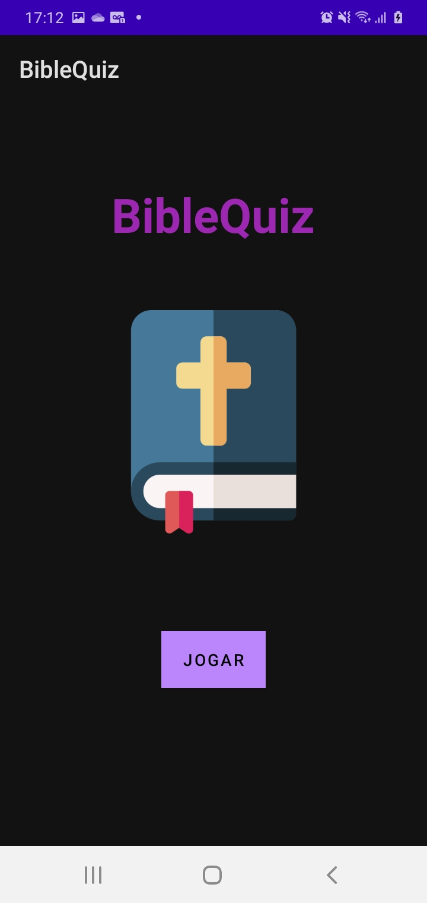
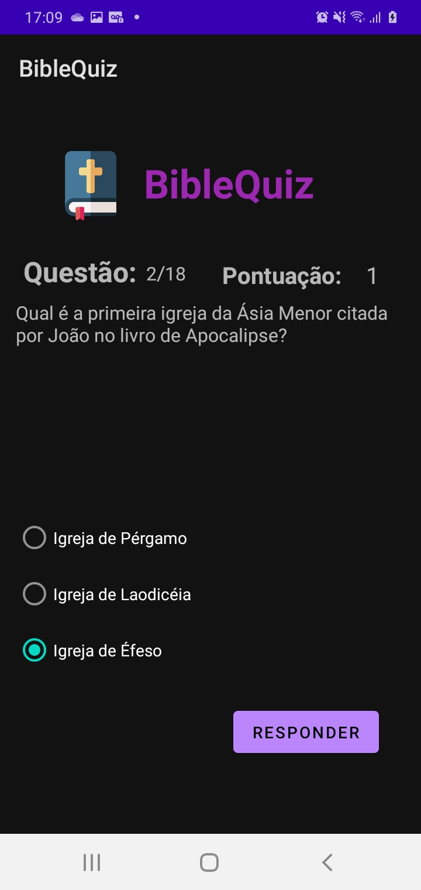
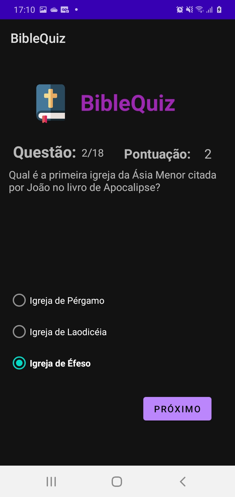

 
    <h1>Bible Quiz ✝️</h1>
    

# About the project 💡

Android quiz game developed for the mobile programing classes of my technical course. After 2 bimesters I could practice what I´ve learned about Java and Android concepts. It´s my first real android project, and marks a new phase on which I´m moving to android native development. My future goals are to develop myself in the area and find out what better pleases me! 

## Screenshots 📸

    
    
    

## What I learned 📖

- [ ] Using and parsing local XML resources
- [ ] OOP principles, such as static props and getters and setters
- [ ] Methods polimorphism

# What I intend to learn from now ✔️

- [ ] Constraint Layout
- [ ] Class inheritance 
- [ ] Activities lifecycle
- [ ] XML layout principles

# Author 💻

- Frontend Mentor - [@HenriquePinheiro12](https://www.frontendmentor.io/profile/HenriquePinheiro12)
- Github - [@HenriquePinheiroo12](https://github.com/henriquepinheiro12/)
- Linkedin - [@Henrique Pinheiro](https://www.linkedin.com/in/henrique-pinheiro-a43b62203/)

***
[MIT LICENSE](https://github.com/HenriquePinheiro12/bible-quizz/blob/main/LICENSE)
